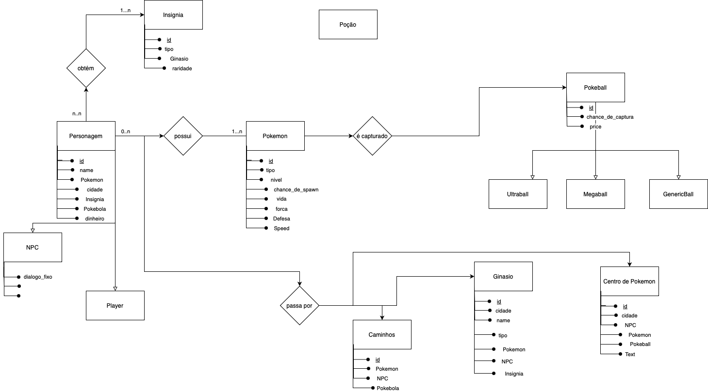

# **Descrição do Artefato DER - Primeira Versão**

## DER:

### Entidades:

#### **Pokemon**
   - Representa os diferentes Pokémon disponíveis no jogo. Cada Pokémon tem atributos específicos como nome, tipo, habilidades, etc.

#### **Porção**
   - Representa itens de cura e melhoria de status que os jogadores podem usar para recuperar a saúde dos Pokémon ou melhorar suas estatísticas temporariamente.

#### **Insignia**
   - Representa as insígnias que os personagens podem obter ao derrotar líderes de ginásios. Essas insígnias são um símbolo de progresso e habilidade.

#### **Personagem**
   - Representa os personagens dentro do jogo, incluindo treinadores (Players) e personagens não jogáveis (NPCs). Os personagens têm atributos como nome, idade, e podem possuir Pokémon, capturar Pokémon e obter insígnias.

#### **NPC**
   - Subconjunto de Personagem, NPCs são personagens não jogáveis que interagem com o jogador e podem fornecer informações, desafios ou recompensas.

#### **Player**
   - Subconjunto de Personagem, os jogadores são personagens controlados pelos usuários que podem capturar Pokémon, obter insígnias e interagir com o mundo do jogo.

#### **Caminhos**
   - Representa os diferentes caminhos que os personagens podem percorrer no jogo. Esses caminhos conectam diferentes áreas como cidades, ginásios e centros Pokémon.

#### **Ginásio**
   - Representa os ginásios Pokémon onde os personagens podem desafiar líderes de ginásio para ganhar insígnias.

#### **Centro Pokemon**
   - Representa os centros Pokémon onde os jogadores podem curar seus Pokémon e obter assistência.

#### **Pokeball**
    - Representa as pokébolas usadas pelos personagens para capturar Pokémon. Existem diferentes tipos de Pokébolas com diferentes taxas de captura.

### Relacionamentos:

#### **Personagem obtém Insignia**
   - Este relacionamento indica que os personagens podem obter insígnias ao derrotar líderes de ginásio. Cada personagem pode obter várias insígnias.

####  **Personagem possui Pokemon**
   - Indica que os personagens podem possuir vários Pokémon. Um Pokémon pertence a apenas um personagem.

#### **Pokemon é capturado por Pokeball**
   - Este relacionamento representa o fato de que Pokémon são capturados usando Pokébolas. Cada Pokémon é capturado por uma Pokébola específica.

#### **Personagem Passa por Caminhos**
   - Indica que os personagens podem percorrer diferentes caminhos no mundo do jogo. Cada caminho pode ser percorrido por vários personagens.

#### **Personagem Passa por Ginásio**
   - Este relacionamento indica que os personagens podem visitar e desafiar ginásios Pokémon. Cada ginásio pode ser visitado por vários personagens.

#### **Personagem Passa por Centro Pokemon**
   - Indica que os personagens podem visitar centros Pokémon para curar seus Pokémon e obter assistência. Cada centro Pokémon pode ser visitado por vários personagens.

### Descrição Geral:

O Diagrama de Entidade-Relacionamento (DER) na sua primeira versão foi desenvolvido para capturar os principais componentes e interações do universo Pokémon. As entidades centrais incluem Pokémon, itens (como Porção e Pokébola), locais (como Ginásio e Centro Pokémon) e personagens (incluindo jogadores e NPCs). Os personagens são a entidade central do modelo, com vários relacionamentos conectando-os a outras entidades. Eles podem obter insígnias ao desafiar ginásios, possuir e capturar Pokémon usando Pokébolas, e passar por caminhos, ginásios e centros Pokémon ao longo de suas jornadas.

### Histórico de Versões

| Versão | Autor         | Descrição da Alteração                                                                                                                                      | Data       |
|--------|---------------|-------------------------------------------------------------------------------------------------------------------------------------------------------------|------------|
| 1.0    | Todos Integrantes  | Criação da primeira versão do modelo DER. | 08/04/2024|
| 1.1    |  Arthur José  | Descricão do Artefato DER primeira versao  | 15/07/2024|
