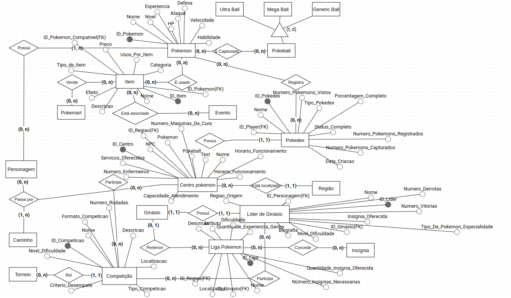

# **Descrição do Artefato DER - Segunda Versão**

## DER:

    
<strong>Entidades e Atributos</strong>

    <ul class="relationship-list">
</li>

<strong>Pokemon</strong>

<ul id="pokemonAttributesList">
  <li>ID_Pokemon</li>
  <li>Nome</li>
  <li>Nível</li>
  <li>Experiência</li>
  <li>HP</li>
  <li>Ataque</li>
  <li>Defesa</li>
  <li>Velocidade</li>
  <li>Habilidade</li>
</ul>

    
<strong>Item</strong>

    <ul class="attribute-list">
        <li>ID_Item</li>
        <li>Nome</li>
        <li>Descrição</li>
        <li>Efeito</li>
        <li>Tipo de Item (Consumível, Equipamento, Evolutivo, Aprendizado, Medicinais, Pokebolas, batalha, valiosos, Apriorísticos (Mega Evolução), decoração, eventos)</li>
        <li>Preço</li>
        <li>Usos por Item (número de vezes que pode ser usado)</li>
        <li>Categoria (Medicinal, Batalha, Aprimoramento, etc.)</li>
        <li>ID_Pokemon_Compatível (FK) (especificar se é compatível com Pokémon específicos)</li>
        <li>ID_Evento (FK) (se o item está relacionado a algum evento específico)</li>
    </ul>

    
<strong>Personagem</strong>

    <ul class="attribute-list">
        <li>ID_Personagem</li>
        <li>Nome</li>
        <li>Função (Treinador, Líder de Ginásio, Membro da Equipe Rocket, etc.)</li>
        <li>Pokemon</li>
        <li>Cidade</li>
        <li>Insignia</li>
        <li>Pokeballs</li>
        <li>Dinheiro</li>
    </ul>

    
<strong>NPC</strong>

    <ul class="attribute-list">
        <li>ID_NPC</li>
        <li>Nome</li>
        <li>Localização</li>
    </ul>

    
<strong>Player</strong>

    <ul class="attribute-list">
        <li>ID_Player</li>
        <li>Nome</li>
        <li>ID_Personagem (FK)</li>
        <li>ID_Pokedex (FK)</li>
    </ul>

    
<strong>Caminho</strong>

    <ul class="attribute-list">
        <li>ID_Caminho</li>
        <li>Nome</li>
        <li>Descrição</li>
        <li>Pokemon</li>
        <li>NPC</li>
        <li>Pokebola</li>
    </ul>

    
<strong>Centro Pokémon</strong>

    <ul class="attribute-list">
        <li>ID_Centro</li>
        <li>NPC</li>
        <li>Pokemon</li>
        <li>Pokeball</li>
        <li>Text</li>
        <li>Nome</li>
        <li>Horário de Funcionamento</li>
        <li>Capacidade de Atendimento (número de Pokémons que podem ser atendidos ao mesmo tempo)</li>
        <li>Número de Enfermeiros</li>
        <li>Serviços Oferecidos (Curar Pokémon, PC Box, Troca de Pokémon)</li>
        <li>Número de Máquinas de Cura</li>
        <li>ID_Região (FK)</li>
    </ul>

    
<strong>Tipo</strong>

    <ul class="attribute-list">
        <li>ID_Tipo</li>
        <li>Nome</li>
        <li>Descrição</li>
    </ul>

    
<strong>Habilidade</strong>

    <ul class="attribute-list">
        <li>ID_Habilidade</li>
        <li>Nome</li>
        <li>Descrição</li>
    </ul>

    
<strong>Região</strong>

    <ul class="attribute-list">
        <li>ID_Região</li>
        <li>Nome</li>
        <li>Descrição</li>
    </ul>

    
<strong>Natureza</strong>

    <ul class="attribute-list">
        <li>ID_Natureza</li>
        <li>Nome</li>
        <li>Efeito</li>
    </ul>

    
<strong>Evolução</strong>

    <ul class="attribute-list">
        <li>ID_Evolução</li>
        <li>Pokemon_Inicial (FK)</li>
        <li>Pokemon_Final (FK)</li>
        <li>Nível</li>
    </ul>

    
<strong>Mega Evolução</strong>

    <ul class="attribute-list">
        <li>ID_MegaEvolução</li>
        <li>Pokemon_Inicial (FK)</li>
        <li>Pokemon_Mega (FK)</li>
        <li>Item_Necessário (FK)</li>
    </ul>

    
<strong>Espécie</strong>

    <ul class="attribute-list">
        <li>ID_Espécie</li>
        <li>Nome</li>
        <li>Descrição</li>
    </ul>

    
<strong>Geração</strong>

    <ul class="attribute-list">
        <li>ID_Geração</li>
        <li>Número</li>
        <li>Descrição</li>
    </ul>

    
<strong>Evento</strong>

    <ul class="attribute-list">
        <li>ID_Evento</li>
        <li>Nome</li>
        <li>Descrição</li>
        <li>Data</li>
    </ul>

    
<strong>Ginásio</strong>

    <ul class="attribute-list">
        <li>ID_Ginásio</li>
        <li>Cidade</li>
        <li>Nome</li>
        <li>Tipo</li>
        <li>Pokemon</li>
        <li>NPC</li>
        <li>Insignia</li>
        <li>Localização</li>
        <li>ID_Líder (FK)</li>
    </ul>

    
<strong>Líder de Ginásio</strong>

    <ul class="attribute-list">
        <li>ID_Líder</li>
        <li>Nome</li>
        <li>ID_Personagem (FK)</li>
        <li>ID_Ginásio (FK)</li>
        <li>Tipo de Pokémon Especialidade (Fogo, Água, Planta, ...)</li>
        <li>Nível de Dificuldade (Iniciante, Intermediário, Avançado)</li>
        <li>Biografia</li>
        <li>Número de Vitórias</li>
        <li>Número de Derrotas</li>
        <li>Insígnia Oferecida</li>
        <li>Região de Origem</li>
    </ul>

    
<strong>Competição</strong>

    <ul class="attribute-list">
        <li>ID_Competição</li>
        <li>Nome</li>
        <li>Descrição</li>
        <li>Localização</li>
        <li>Tipo de Competição (Torneio, Campeonato, Desafio)</li>
        <li>Nível de Dificuldade (Iniciante, Intermediário, Avançado)</li>
        <li>Formato da Competição (Eliminatória, Pontuação)</li>
        <li>Número de Rodadas</li>
        <li>Critérios de Desempate</li>
    </ul>

    
<strong>Pokedex</strong>

    <ul class="attribute-list">
        <li>ID_Pokedex</li>
        <li>Nome</li>
        <li>ID_Player (FK)</li>
        <li>Data de Criação</li>
        <li>Número de Pokémon Registrados</li>
        <li>Número de Pokémon Vistos</li>
        <li>Número de Pokémon Capturados</li>
        <li>Status de Completo (sim/não)</li>
        <li>Porcentagem de Completo</li>
        <li>Tipo de Pokedex (Regional/Nacional)</li>
    </ul>

    
<strong>Equipe Rocket</strong>

    <ul class="attribute-list">
        <li>ID_Membro</li>
        <li>Nome</li>
        <li>ID_Personagem (FK)</li>
    </ul>

    
<strong>Torneio</strong>

    <ul class="attribute-list">
        <li>ID_Torneio</li>
        <li>Nome</li>
        <li>Descrição</li>
    </ul>

    
<strong>PokeMart</strong>

    <ul class="attribute-list">
        <li>ID_PokeMart</li>
        <li>Nome</li>
        <li>Localização</li>
    </ul>

    
<strong>Fossil</strong>

    <ul class="attribute-list">
        <li>ID_Fossil</li>
        <li>Nome</li>
        <li>Descrição</li>
    </ul>

    
<strong>Liga Pokémon</strong>

    <ul class="attribute-list">
        <li>ID_Liga</li>
        <li>Nome</li>
        <li>Localização</li>
        <li>ID_Região (FK)</li>
        <li>Número de Insígnias Necessárias</li>
        <li>Descrição</li>
        <li>Quantidade de Experiência Ganho</li>
        <li>Quantidade de Insígnias Oferecidas</li>
        <li>Dificuldade (Iniciante, Intermediário, Avançado)</li>
        <li>ID_Ginásio (FK) (Referência ao ginásio associado, se tiver)</li>
    </ul>

    
<strong>Insígnia</strong>

    <ul class="attribute-list">
        <li>ID_Insígnia</li>
        <li>Nome</li>
        <li>Descrição</li>
    </ul>

            </ul>
        </li>
    </ul>

</body>
</html>

</body>
</html>

    
<strong>Relacionamentos Entre Entidades</strong>

    <ul class="relationship-list">
</li>
            </ul>
        </li>
        <li>
            <strong>Item e Pokemon</strong>
            <ul>
                <li><strong>Item é Compatível com Pokémon</strong></li>
                <li>Um Item pode ser compatível com nenhum ou vários Pokémon (0,n).</li>
                <li>Um Pokémon pode usar nenhum ou vários Itens (0,n).</li>
            </ul>
        </li>
        <li>
            <strong>Item e Evento</strong>
            <ul>
                <li><strong>Item está associado a Evento</strong></li>
                <li>Um Item pode estar associado a nenhum ou a um Evento (0,n).</li>
                <li>Um Evento pode ter vários Itens associados (0,n).</li>
            </ul>
        </li>
        <li>
            <strong>Player e Pokedex</strong>
            <ul>
                <li><strong>Player possui Pokedex</strong></li>
                <li>Um Player tem uma Pokedex (1,1).</li>
                <li>Uma Pokedex pertence a um Player (1,1).</li>
            </ul>
        </li>
        <li>
            <strong>Centro Pokémon e Região</strong>
            <ul>
                <li><strong>Centro Pokémon está localizado em Região</strong></li>
                <li>Um Centro Pokémon está localizado em uma Região (1,1).</li>
                <li>Uma Região pode ter vários Centros Pokémon (0,n).</li>
            </ul>
        </li>
        <li>
            <strong>Ginásio e Líder de Ginásio</strong>
            <ul>
                <li><strong>Ginásio tem Líder de Ginásio</strong></li>
                <li>Um Ginásio tem um Líder de Ginásio (1,1).</li>
                <li>Um Líder de Ginásio está associado a um Ginásio (1,1).</li>
            </ul>
        </li>
        <li>
            <strong>Líder de Ginásio e Competição</strong>
            <ul>
                <li><strong>Líder de Ginásio pode participar de Competição</strong></li>
                <li>Um Líder de Ginásio pode participar de uma ou mais Competições (0,n).</li>
                <li>Uma Competição pode ter vários Líderes de Ginásio participando (0,n).</li>
            </ul>
        </li>
        <li>
            <strong>Ginásio e Liga Pokémon</strong>
            <ul>
                <li><strong>Ginásio pertence a Liga Pokémon</strong></li>
                <li>Um Ginásio pode estar associado a uma Liga Pokémon (0,1).</li>
                <li>Uma Liga Pokémon pode ter vários Ginásios (0,n).</li>
            </ul>
        </li>
        <li>
            <strong>Competição e Player</strong>
            <ul>
                <li><strong>Player participa de Competição</strong></li>
                <li>Um Player pode participar de várias Competições (0,n).</li>
                <li>Uma Competição pode ter vários Players participando (0,n).</li>
            </ul>
        </li>
        <li>
            <strong>Pokedex e Pokemon</strong>
            <ul>
                <li><strong>Pokedex registra Pokémon</strong></li>
                <li>Uma Pokedex registra vários Pokémon (0,n).</li>
                <li>Um Pokémon pode ser registrado em várias Pokedex (0,n).</li>
            </ul>
        </li>
        <li>
            <strong>Torneio e Competição</strong>
            <ul>
                <li><strong>Torneio pode ser um tipo de Competição</strong></li>
                <li>Um Torneio é um tipo de Competição (1,1).</li>
                <li>Uma Competição pode ser um Torneio (0,n).</li>
            </ul>
        </li>
        <li>
            <strong>PokeMart e Item</strong>
            <ul>
                <li><strong>PokeMart vende Item</strong></li>
                <li>Um PokeMart pode vender vários Itens (0,n).</li>
                <li>Um Item pode estar disponível em vários PokeMarts (0,n).</li>
            </ul>
        </li>
        <li>
            <strong>Fossil e Pokemon</strong>
            <ul>
                <li><strong>Fossil pode ser usado para recriar Pokémon</strong></li>
                <li>Um Fossil pode ser usado para recriar um Pokémon específico (1,1).</li>
                <li>Um Pokémon pode ser recriado a partir de vários Fossils (0,n).</li>
            </ul>
        </li>
        <li>
            <strong>Liga Pokémon e Insígnia</strong>
            <ul>
                <li><strong>Liga Pokémon concede Insígnias</strong></li>
                <li>Uma Liga Pokémon concede várias Insígnias (0,n).</li>
                <li>Uma Insígnia é concedida por uma Liga Pokémon (1,1).</li>
            </ul>
        </li>
    </ul>

</body>
</html>

### Descrição Geral:

O Diagrama de Entidade-Relacionamento (DER) na sua primeira versão foi desenvolvido para capturar os principais componentes e interações do universo Pokémon. As entidades centrais incluem Pokémon, itens (como Porção e Pokébola), locais (como Ginásio e Centro Pokémon) e personagens (incluindo jogadores e NPCs). Os personagens são a entidade central do modelo, com vários relacionamentos conectando-os a outras entidades. Eles podem obter insígnias ao desafiar ginásios, possuir e capturar Pokémon usando Pokébolas, e passar por caminhos, ginásios e centros Pokémon ao longo de suas jornadas.

### Histórico de Versões

| Versão | Autor         | Descrição da Alteração                                                                                                                                      | Data       |
|--------|---------------|-------------------------------------------------------------------------------------------------------------------------------------------------------------|------------|
| 1.0    | Todos Integrantes  | Criação da segunda versão do modelo DER. | 16/07/2024|
| 1.1    |  Carlos Gabriel  | Descrição do Artefato DER segunda versão  | 16/07/2024|
| 1.2    |  Carlos Gabriel  | Organização do Artefato DER segunda versão  | 16/07/2024|
