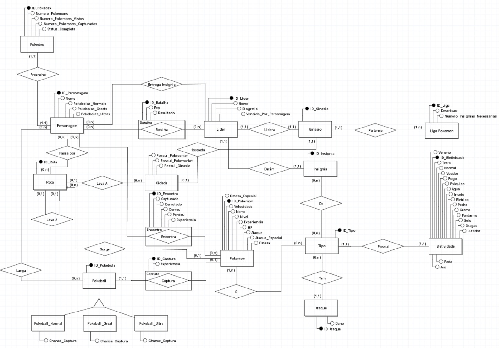

# **Descrição do Artefato DER - Terceira Versão**

## DER:

## Principais Alterações

- Melhor organização do Diagrama e geral
- Substituicao de algumas entidades para melhorar a regra de negocio do jogo.
- Remoção de algumas entidades que nao se adequaram ao contexto (Evento, Regiao, Caminho)
- Organizar e revisar Cardinalidades.

    
<strong>Entidades e Atributos</strong>

    <ul class="relationship-list">
        <li>
            

                
<strong>Efetividade</strong>

                <ul class="attribute-list">
                    <li>ID_Efetividade</li>
                    <li>Veneno</li>
                    <li>Terra</li>
                    <li>Normal</li>
                    <li>Voador</li>
                    <li>Fogo</li>
                    <li>Psiquico</li>
                    <li>Agua</li>
                    <li>Inseto</li>
                    <li>Eletrico</li>
                    <li>Pedra</li>
                    <li>Grama</li>
                    <li>Fantasma</li>
                    <li>Gelo</li>
                    <li>Dragao</li>
                    <li>Lutador</li>
                    <li>Fada</li>
                    <li>Aco</li>
                </ul>
            

        </li>
        <li>
            

                
<strong>Pokedex</strong>

                <ul class="attribute-list">
                    <li>ID_Pokedex</li>
                    <li>Numero_Pokemons</li>
                    <li>Numero_Pokemons_Vistos</li>
                    <li>Numero_Pokemons_Capturados</li>
                    <li>Status_Completa</li>
                </ul>
            

        </li>
        <li>
            

                
<strong>Personagem</strong>

                <ul class="attribute-list">
                    <li>ID_Personagem</li>
                    <li>Nome</li>
                    <li>Pokebolas_Normais</li>
                    <li>Pokebolas_Greats</li>
                    <li>Pokebolas_Ultras</li>
                </ul>
            

        </li>
        <li>
            

                
<strong>Rota</strong>

                <ul class="attribute-list">
                    <li>ID_Rota</li>
                </ul>
            

        </li>
        <li>
            

                
<strong>Pokebola</strong>

                <ul class="attribute-list">
                    <li>ID_Pokebola</li>
                </ul>
            

        </li>
        <li>
            

                
<strong>Pokeball_Normal</strong>

                <ul class="attribute-list">
                    <li>Chance_Captura</li>
                </ul>
            

        </li>
        <li>
            

                
<strong>Pokeball_Great</strong>

                <ul class="attribute-list">
                    <li>Chance_Captura</li>
                </ul>
            

        </li>
        <li>
            

                
<strong>Pokeball_Ultra</strong>

                <ul class="attribute-list">
                    <li>Chance_Captura</li>
                </ul>
            

        </li>
        <li>
            

                
<strong>Batalha</strong>

                <ul class="attribute-list">
                    <li>ID_Batalha</li>
                    <li>Exp</li>
                    <li>Resultado</li>
                </ul>
            

        </li>
        <li>
            

                
<strong>Lider</strong>

                <ul class="attribute-list">
                    <li>ID_Lider</li>
                    <li>Nome</li>
                    <li>Biografia</li>
                    <li>Vendido_Por_Personagem</li>
                </ul>
            

        </li>
        <li>
            

                
<strong>Ginasio</strong>

                <ul class="attribute-list">
                    <li>ID_Ginasio</li>
                </ul>
            

        </li>
        <li>
            

                
<strong>Insignia</strong>

                <ul class="attribute-list">
                    <li>ID_Insignia</li>
                </ul>
            

        </li>
        <li>
            

                
<strong>Liga Pokemon</strong>

                <ul class="attribute-list">
                    <li>ID_Liga</li>
                    <li>Descricao</li>
                    <li>Numero_Insignias_Necessarias</li>
                </ul>
            

        </li>
        <li>
            

                
<strong>Cidade</strong>

                <ul class="attribute-list">
                    <li>ID_Cidade</li>
                    <li>Possui_Pokecenter</li>
                    <li>Possui_Pokemarket</li>
                    <li>Possui_Ginasio</li>
                </ul>
            

        </li>
        <li>
            

                
<strong>Encontro</strong>

                <ul class="attribute-list">
                    <li>ID_Encontro</li>
                    <li>Capturado</li>
                    <li>Derrotado</li>
                    <li>Correu</li>
                    <li>Perdeu</li>
                    <li>Experiencia</li>
                </ul>
            

        </li>
        <li>
            

                
<strong>Captura</strong>

                <ul class="attribute-list">
                    <li>ID_Captura</li>
                    <li>Experiencia</li>
                </ul>
            

        </li>
        <li>
            

                
<strong>Pokemon</strong>

                <ul class="attribute-list">
                    <li>ID_Pokemon</li>
                    <li>Defesa_Especial</li>
                    <li>Nome</li>
                    <li>Velocidade</li>
                    <li>HP</li>
                    <li>Nivel</li>
                    <li>Experiencia</li>
                    <li>Ataque_Especial</li>
                    <li>Defesa</li>
                </ul>
            

        </li>
        <li>
            

                
<strong>Tipo</strong>

                <ul class="attribute-list">
                    <li>ID_Tipo</li>
                    <li>Eficiencia</li>
                </ul>
            

        </li>
        <li>
            

                
<strong>Ataque</strong>

                <ul class="attribute-list">
                    <li>ID_Ataque</li>
                    <li>Dano</li>
                </ul>
            

        </li>
    </ul>

</body>
</html>

    
<strong>Relacionamentos</strong>

    <ul class="relationship-list">
        <li>
            

                
<strong>Preenche</strong>

                
<strong>Descrição:</strong> O relacionamento indica que a Pokedex é preenchida por Pokemons capturados ou vistos pelo Personagem.

                
<strong>Cardinalidade:</strong>

                <ul>
                    <li>Pokedex (1) - Preenche (0..n)</li>
                    <li>Personagem (0..n) - Preenche (1)</li>
                </ul>
            

        </li>
        <li>
            

                
<strong>Passa por</strong>

                
<strong>Descrição:</strong> O relacionamento indica que o Personagem passa por diversas Rotas.

                
<strong>Cardinalidade:</strong>

                <ul>
                    <li>Personagem (1) - Passa por (0..n)</li>
                    <li>Rota (0..n) - Passa por (1)</li>
                </ul>
            

        </li>
        <li>
            

                
<strong>Leva A</strong>

                
<strong>Descrição:</strong> O relacionamento indica que a Rota pode levar a outra Rota.

                
<strong>Cardinalidade:</strong>

                <ul>
                    <li>Rota (0..1) - Leva A (0..n)</li>
                    <li>Rota (0..n) - Leva A (0..1)</li>
                </ul>
            

        </li>
        <li>
            

                
<strong>Lança</strong>

                
<strong>Descrição:</strong> O relacionamento indica que o Personagem lança uma Pokebola para capturar um Pokemon.

                
<strong>Cardinalidade:</strong>

                <ul>
                    <li>Personagem (0..n) - Lança (0..n)</li>
                    <li>Pokebola (0..n) - Lança (0..1)</li>
                </ul>
            

        </li>
        <li>
            

                
<strong>Surge</strong>

                
<strong>Descrição:</strong> O relacionamento indica que um Encontro surge em uma Rota.

                
<strong>Cardinalidade:</strong>

                <ul>
                    <li>Encontro (0..n) - Surge (0..1)</li>
                    <li>Rota (0..n) - Surge  (0..1)</li>
                </ul>
            

        </li>
        <li>
            

                
<strong>Encontra</strong>

                
<strong>Descrição:</strong> O relacionamento indica que o Personagem encontra um Pokemon em um Encontro.

                
<strong>Cardinalidade:</strong>

                <ul>
                    <li>Personagem (0..1) - Encontra (0..n)</li>
                    <li>Encontro (0..n) - Encontra (0..1)</li>
                </ul>
            

        </li>
        <li>
            

                
<strong>Captura</strong>

                
<strong>Descrição:</strong> O relacionamento indica que um Personagem pode capturar um Pokemon durante um Encontro.

                
<strong>Cardinalidade:</strong>

                <ul>
                    <li>Captura (0..n) - Captura (0..1)</li>
                    <li>Encontro (0..1) - Captura (0..n)</li>
                </ul>
            

        </li>
        <li>
            

                
<strong>Batalha</strong>

                
<strong>Descrição:</strong> O relacionamento indica que o Personagem batalha contra o Lider de um Ginasio.

                
<strong>Cardinalidade:</strong>

                <ul>
                    <li>Batalha (0..n) - Batalha (1..1)</li>
                    <li>Lider (1..1) - Batalha (0..n)</li>
                </ul>
            

        </li>
        <li>
            

                
<strong>Entrega Insígnia</strong>

                
<strong>Descrição:</strong> O relacionamento indica que após uma batalha, um Lider pode entregar uma Insignia ao Personagem.

                
<strong>Cardinalidade:</strong>

                <ul>
                    <li>Lider (1..1) - Entrega Insígnia (0..n)</li>
                    <li>Personagem (0..n) - Entrega Insígnia (1..1)</li>
                </ul>
            

        </li>
        <li>
            

                
<strong>Lidera</strong>

                
<strong>Descrição:</strong> O relacionamento indica que um Lider lidera um Ginasio.

                
<strong>Cardinalidade:</strong>

                <ul>
                    <li>Lider (1..1) - Lidera (1..1)</li>
                    <li>Ginasio (1..1) - Lidera (1..1)</li>
                </ul>
            

        </li>
        <li>
            

                
<strong>Detém</strong>

                
<strong>Descrição:</strong> O relacionamento indica que um Ginasio detém uma Insignia.

                
<strong>Cardinalidade:</strong>

                <ul>
                    <li>Ginasio (1..1) - Detém (0..n)</li>
                    <li>Insignia (0..n) - Detém (1..1)</li>
                </ul>
            

        </li>
        <li>
            

                
<strong>Pertence</strong>

                
<strong>Descrição:</strong> O relacionamento indica que um Ginasio pertence a uma Liga Pokemon.

                
<strong>Cardinalidade:</strong>

                <ul>
                    <li>Ginasio (1..1) - Pertence (0..n)</li>
                    <li>Liga Pokemon (1..n) - Pertence (1..1)</li>
                </ul>
            

        </li>
        <li>
            

                
<strong>Hospeda</strong>

                
<strong>Descrição:</strong> O relacionamento indica que uma Cidade hospeda um Ginasio, Pokecenter e Pokemarket.

                
<strong>Cardinalidade:</strong>

                <ul>
                    <li>Cidade (0..1) - Hospeda (0..n)</li>
                    <li>Ginasio (0..1) - Hospeda (0..1)</li>
                    <li>Pokecenter (0..1) - Hospeda (0..1)</li>
                    <li>Pokemarket (0..1) - Hospeda (0..1)</li>
                </ul>
            

        </li>
        <li>
            

                
<strong>É</strong>

                
<strong>Descrição:</strong> O relacionamento indica que um Pokemon possui um ou mais Tipos.

                
<strong>Cardinalidade:</strong>

                <ul>
                    <li>Pokemon (1..n) - É (1..1)</li>
                    <li>Tipo (1..1) - É (0..n)</li>
                </ul>
            

        </li>
        <li>
            

                
<strong>Tem</strong>

                
<strong>Descrição:</strong> O relacionamento indica que um Pokemon tem um ou mais Ataques.

                
<strong>Cardinalidade:</strong>

                <ul>
                    <li>Pokemon (1..n) - Tem (0..n)</li>
                    <li>Ataque (1..1) - Tem (0..n)</li>
                </ul>
            

        </li>
        <li>
            

                
<strong>Possui</strong>

                
<strong>Descrição:</strong> O relacionamento indica que um Tipo possui uma ou mais Efetividades.

                
<strong>Cardinalidade:</strong>

                <ul>
                    <li>Tipo (1..1) - Possui (1..1)</li>
                    <li>Efetividade (1..1) - Possui (0..n)</li>
                </ul>
            

        </li>
    </ul>

</body>
</html>

### Descrição Geral:

O Diagrama de Entidade-Relacionamento (DER) na sua primeira versão foi desenvolvido para capturar os principais componentes e interações do universo Pokémon. As entidades centrais incluem Pokemon, objetos (como insignia e Pokebola), locais (como Ginásio e Cidade) e personagens. Os personagens são a entidade central do modelo, com vários relacionamentos conectando-os a outras entidades. Eles podem obter insígnias ao desafiar ginásios, possuir e capturar Pokemons usando Pokebolas, e passar por rotas e ginásios ao longo de suas jornadas.

### Histórico de Versões

| Versão | Autor         | Descrição da Alteração                                                                                                                                      | Data       |
|--------|---------------|-------------------------------------------------------------------------------------------------------------------------------------------------------------|------------|
| 1.0    | Todos Integrantes  | Criação da segunda versão do modelo DER. | 21/07/2024|
| 1.1    |  Carlos Gabriel  | Descricão do Artefato DER terceira versão  | 21/07/2024|
| 1.1    | Todos Integrantes | Revisão e Pequenas alteracoes no Der v3. | 22/07/2024|
