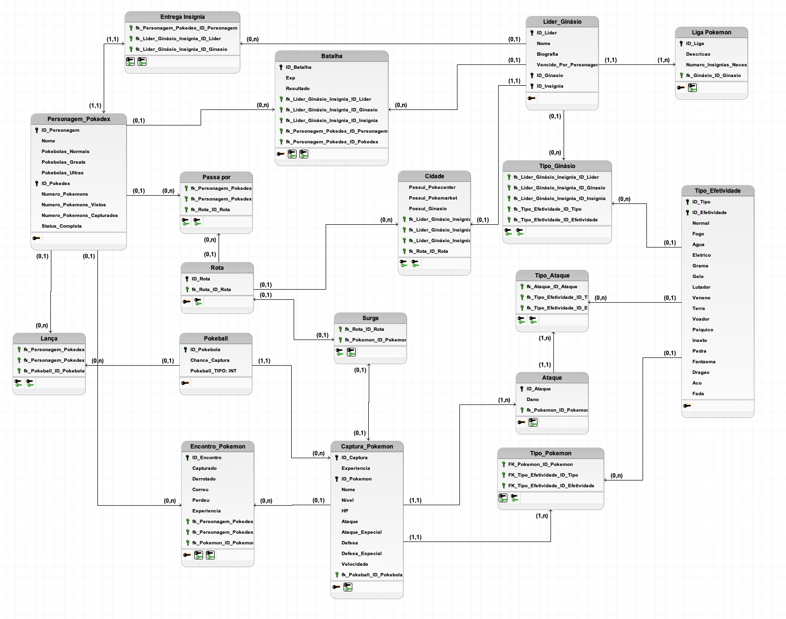

# Modelo Lógico

## Introducao:

O modelo lógico é uma representação abstrata de um banco de dados, que descreve a estrutura dos dados e as relações entre eles, sem considerar o banco de dados físico, que detalha como os dados serão implementados.

O modelo lógico inclui todas as informações essenciais para o funcionamento diário dos negócios. Um projeto lógico é a implementação desse modelo em um banco de dados real.

Ele descreve como os dados serão armazenados e organizados em tabelas, colunas, e chaves primárias e estrangeiras. O projeto lógico é baseado no modelo lógico e é utilizado para criar um banco de dados físico, que pode ser usado para armazenar e recuperar dados

## Representação:

## Introdução

| Versão | Autor         | Descrição da Alteração                                                                                                                                      | Data       |
|--------|---------------|-------------------------------------------------------------------------------------------------------------------------------------------------------------|------------|
| 1.0    | Todos Integrantes  | Criação do Modelo Lógicos | 22/07/2024|
